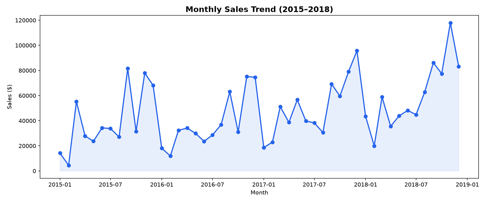
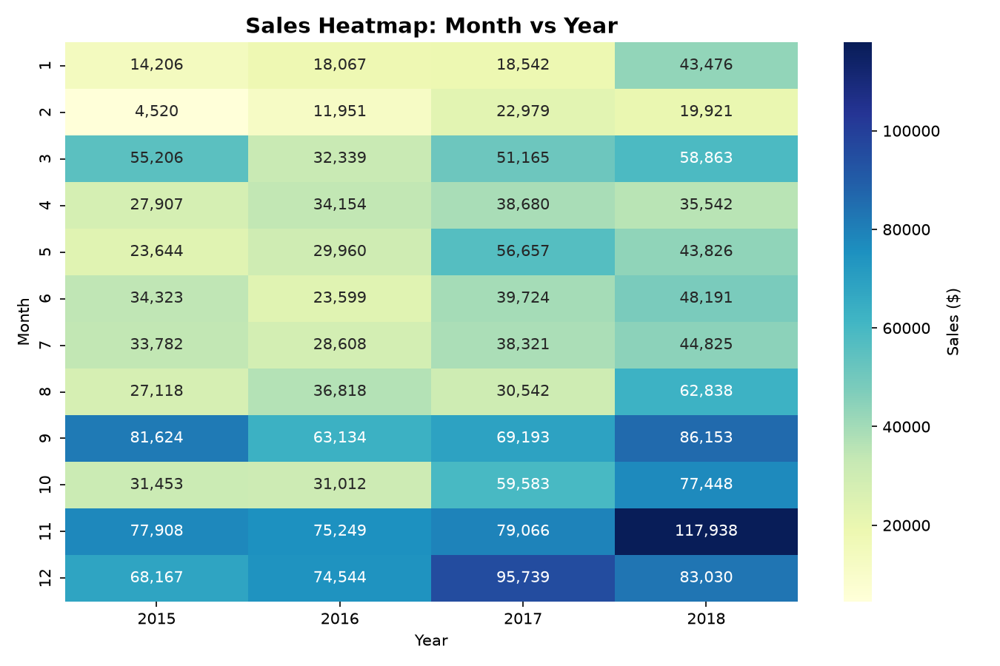
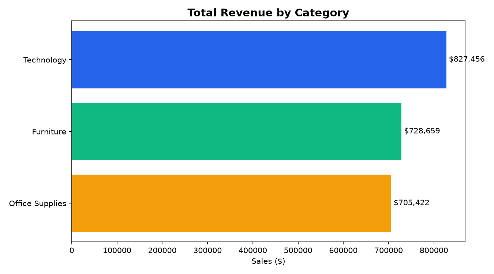
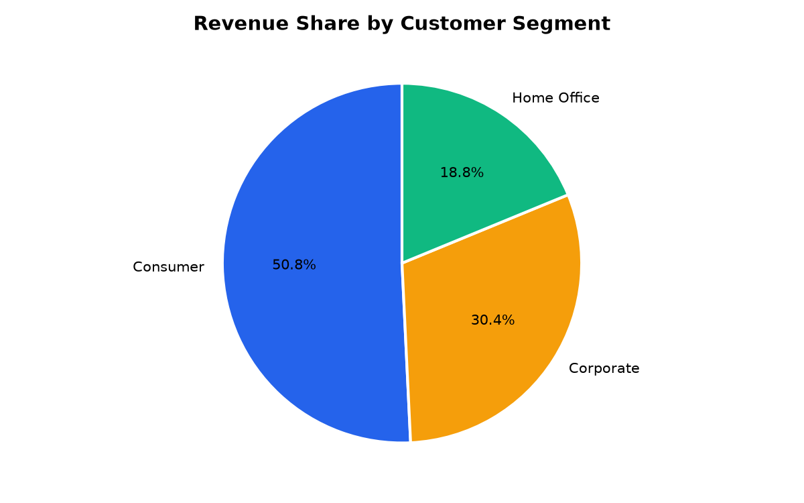

# Retail Sales Data Analysis

**Tools:** Python · Pandas · NumPy · Matplotlib · Seaborn · SQL (SQLite)

Exploratory data analysis on a retail Superstore dataset (9,800 orders, Jan 2015 – Dec 2018).
The notebook cleans the raw data, answers business questions with SQL, and visualizes
customer purchasing trends, seasonal sales patterns, and top-performing product categories.

## What's inside

- **`Sales_Data_Analysis.ipynb`** — full analysis notebook (clean → SQL → EDA → charts → insights)
- **`train.csv`** — source dataset
- **`chart_*.png`** — exported chart images

## Key findings

- Sales spike sharply in **November–December** every year, with a secondary peak in September — a clear holiday/back-to-office seasonal pattern.
- **Technology** and **Furniture** drive the highest revenue per order; **Office Supplies** drives the highest order volume at a lower average order value.
- A small set of sub-categories (Phones, Chairs, Storage) account for a disproportionate share of total revenue — an 80/20 pattern.
- The **Consumer** segment contributes the largest share of revenue overall, while **Corporate** and **Home Office** customers place fewer but higher-value orders.
- The **West** and **East** regions outperform **Central** and **South** in total revenue.

## Sample visualizations

| Monthly Sales Trend | Seasonality Heatmap |
|---|---|
|  |  |

| Revenue by Category | Revenue Share by Segment |
|---|---|
|  |  |

## How to run

```bash
pip install pandas numpy matplotlib seaborn
jupyter notebook Sales_Data_Analysis.ipynb
```

## Next steps

- Add `Profit`/`Discount` fields to analyze margin, not just revenue
- Build an RFM (Recency, Frequency, Monetary) customer segmentation
- Forecast next-quarter sales from the monthly trend
